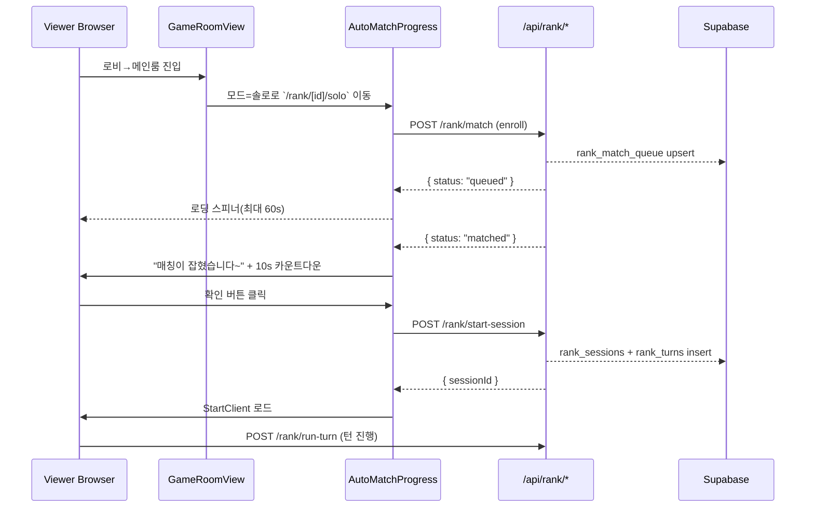
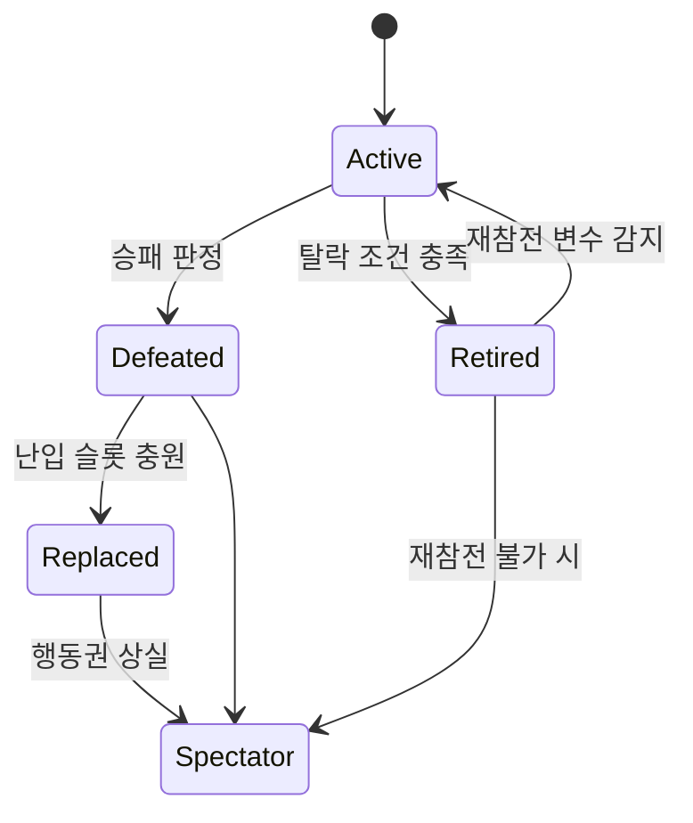
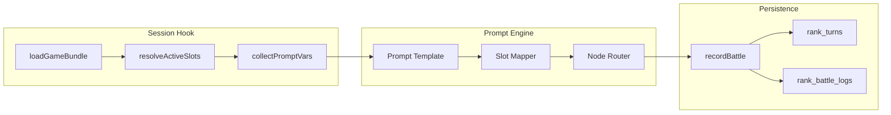

# Rank Game Blueprint – Test Plan & Diagram Pack

이 문서는 랭크 게임 청사진을 검증하기 위한 테스트 시나리오와 핵심 플로우 다이어그램을 정리한 자료입니다. 모든 테스트는 블루프린트 단계별 산출물과 연동되며, 구현 진행률 보고 시 함께 참조할 수 있도록 구성했습니다.

## 1. 테스트 범주

| 범주 | 주요 목적 | 선행 조건 | 관련 단계 |
| --- | --- | --- | --- |
| 매칭 자동화 | 로비→매칭→전투 진입이 완전 자동으로 이어지는지 검증 | GameRoom 슬롯 데이터 로딩, `AutoMatchProgress` 연결 | 단계 1, 2 |
| 세션 & 전투 로깅 | `/api/rank/start-session`, `/api/rank/run-turn`, `recordBattle` 흐름 검증 | Supabase 세션 토큰 발급, 서비스 롤 권한 | 단계 2, 3 |
| 프롬프트 컴파일 | 슬롯 변수, 상태 매핑, 난입 대체를 포함한 프롬프트 생성 확인 | Prompt Builder 세트 배포 | 단계 3 |
| 난입 / 재참전 | 패배·탈락 슬롯이 난입 또는 재참전 규칙을 따른는지 검증 | `rank_match_queue` 난입 플래그, 역할 메타 | 단계 3 |
| UI / 오디오 체험 | 모바일 세로 레이아웃과 히어로 오디오 프리셋이 정상 재생되는지 확인 | Hero 오디오 프리셋 컬럼, StartClient 오디오 매니저 | 단계 4 |
| 실시간/비실시간 변형 | 실시간 토글에 따라 큐·턴 타이머·합의 로직이 어떻게 변하는지 검증 | Queue config, Timer vote | 단계 5 |

## 2. 우선 수동 테스트 케이스

### 2.1 매칭 자동화 – 솔로 랭크

| ID | 시나리오 | 단계 | 기대 결과 |
| --- | --- | --- | --- |
| SOLO-01 | 메인룸에서 솔로 랭크 선택 후 매칭 페이지 진입 | 1. 게임 검색→참여 2. 메인룸 `게임 시작` 3. 모드 모달에서 솔로 선택 4. `/rank/[id]/solo` 자동 진입 | `AutoMatchProgress`가 즉시 큐 참가, 히어로 미선택 시 60초 내 메인룸으로 리다이렉트 |
| SOLO-02 | 매칭 확정 후 10초 내 “배틀 시작” 미확정 | SOLO-01 이후 매칭 발생 확인 버튼 미터치 | 카운트다운 종료 시 큐 취소, 메인룸 안내 “참여하지 않으면 불이익” 노출 |
| SOLO-03 | 매칭 확정 후 확인 클릭 | SOLO-01 이후 매칭 발생 확인 버튼 클릭 | `/api/rank/start-session` 호출 성공, StartClient 로딩 전환, 첫 턴 로그 생성 |

### 2.2 듀오 랭크 파티 흐름

| ID | 시나리오 | 단계 | 기대 결과 |
| --- | --- | --- | --- |
| DUO-01 | 방장/파티원 동시 준비 | 1. `/rank/[id]/duo` 진입 2. 파티원 초대 후 슬롯 채우기 3. 자동 큐 진입 | 두 사용자의 큐 상태가 동시에 `queued`→`matched`로 변환 |
| DUO-02 | 파티원 미확정 상태 | DUO-01 1~2단계 후 파티원 준비 미완 | 자동 큐 차단 이유 목록에 “파티원 준비 대기” 노출, 재시도 없음 |
| DUO-03 | 난입 허용 게임에서 패배 슬롯 충원 | 1. 기존 세션에서 한 슬롯 `defeated` 처리 2. 난입 플래그가 켜진 게임으로 듀오 큐 진입 | `/api/rank/match` 응답 `matchType: "brawl"`, 빈 역할 슬롯 목록 표시 |

### 2.3 세션·턴 로깅

| ID | 시나리오 | 단계 | 기대 결과 |
| --- | --- | --- | --- |
| LOG-01 | 세션 생성 성공 | `/api/rank/start-session` 호출 | `rank_sessions`에 row 생성, `rank_turns`에 system turn 0 삽입 |
| LOG-02 | 턴 실행 정상 기록 | StartClient에서 `/api/rank/run-turn` 호출 | `rank_turns`에 prompt/response 저장, `turn_number` 증가 |
| LOG-03 | API 키 고갈 시 무효 처리 | 연속 5줄 입력 규칙을 위반하는 응답 확인 | 세션 무효화, 플레이어에게 API 교체 알림, 5시간 쿨다운 기록 |
| LOG-04 | 히스토리 요약/가시성 플래그 저장 | `/api/rank/run-turn` 혹은 fallback `/api/rank/log-turn` 호출 후 `/api/rank/sessions` 조회 | `rank_turns.is_visible`이 공개/비공개를 반영하고, `summary_payload`·`latest_summary`가 세션 히스토리 응답에 포함됨 |

### 2.4 프롬프트/노드 컴파일

| ID | 시나리오 | 단계 | 기대 결과 |
| --- | --- | --- | --- |
| PROMPT-01 | 탈락 슬롯 대체 | 패배 슬롯 상태 `retired`, 동일 역할 가용 슬롯 존재 | 프롬프트 변수에서 해당 슬롯이 대체 영웅 정보로 치환 |
| PROMPT-02 | 재참전 변수 처리 | 프롬프트 변수에 “(캐릭터명) 재참전” 포함 | 슬롯 상태가 `retired`→`active`로 전환, 프롬프트에 재참전 서술 |
| PROMPT-03 | 인비저블 변수 | 특정 히스토리 항목 `visibility=private` | 시스템 프롬프트/플레이어 히스토리에 비노출, AI 히스토리에는 포함 |
| PROMPT-04 | 구버전 변수 규칙 경고 확인 | StartClient에서 경고 문구 발생 세트 로드 → 제작기 재저장 후 다시 로드 | 첫 로드 시 경고 배너 노출, 재저장 후 재로드 시 경고가 사라지고 콘솔 로그도 남지 않음 |

### 2.5 UI 및 오디오

| ID | 시나리오 | 단계 | 기대 결과 |
| --- | --- | --- | --- |
| UIA-01 | 모바일 세로 레이아웃 | iPhone 13 Pro 시뮬레이터에서 StartClient 실행 | 좌측 역할 열, 중앙 반투명 메인 패널, 우측 히스토리가 세로 스크롤로 배치 |
| UIA-02 | 오디오 프리셋 적용 | 히어로가 EQ/Reverb/Compressor 프리셋 제공 | 다른 히어로로 턴이 바뀔 때 이전 트랙 정지, 새 트랙과 프리셋 적용 |
| UIA-03 | 새 참가자 60초 파악 시간 | 난입 직후 세션 합류 | 제한시간 타이머가 60초로 리셋, 히스토리 상단에 최근 공개 로그 표시 |

### 2.6 재시작·큐 일관성 — 듀오/캐주얼

| ID | 시나리오 | 단계 | 기대 결과 |
| --- | --- | --- | --- |
| DC-01 | `/api/rank/play` 재시작 — 듀오 난입 세션 | 1. 기존 세션에서 듀오 슬롯 패배 처리 2. 난입 허용 플래그 유지 3. `/rank/[id]/duo` 재진입 후 자동 큐 대기 | `rank_match_queue` 상태가 `resumePending` → `matched`로 전환되고 `/api/rank/play` 로그에 `resumeReason: "duo_rejoin"` 기록 |
| DC-02 | `/api/rank/play` 재시작 — 캐주얼 파티 복귀 | 1. 캐주얼 세션 종료 직후 `/rank/[id]/casual` 진입 2. `/api/rank/play` 호출 | 응답 본문에 `sessionReuse: true`, `historyVisibility: "inherit"`가 포함되고, `rank_turns.is_visible` 값이 유지됨 |
| DC-03 | 재시작 실패 롤백 | 1. DC-01과 동일한 흐름 2. `/api/rank/play`가 500 반환하도록 API 키 고갈 상황 모킹 | `rank_match_queue` 엔트리가 `queued`로 복구되고, `rank_api_key_cooldowns`에 실패 원인 기록 + Slack 경보 발송 |

### 2.7 운영 가드 — 쿨다운 감사 로그

| ID | 시나리오 | 단계 | 기대 결과 |
| --- | --- | --- | --- |
| OPS-01 | API 키 쿨다운 자동화 실행 후 감사 로그 확인 | `/api/rank/cooldown-report` 호출 → Slack/Webhook 실패/성공 케이스 모킹 | `rank_api_key_audit`에 status, retry_count, doc_link_attached, automation_payload가 저장되고, Telemetry 대시보드에서 감사 로그 요약이 노출 |
| OPS-02 | 다이제스트 재시도 감사 로그 확인 | `notified_at IS NULL` 상태에서 `/api/rank/cooldown-digest?since_minutes=60` 호출 | 감사 로그 `digest_payload`에 windowMinutes·limit·method가 기록되고, 성공 시 status가 `succeeded`, 실패 시 `retrying`으로 남음 |
| OPS-03 | 임계값 환경 변수 오버라이드 검증 | `RANK_COOLDOWN_ALERT_THRESHOLDS`를 `{ "failureRate": { "warning": 0.1 } }`로 설정 후 `/api/rank/cooldown-telemetry` 호출 | 응답 `alerts.thresholds.failureRate.warning`이 `0.1`로 반영되고, 관리자 대시보드 임계값 정보도 동일하게 갱신됨 |
| OPS-04 | 임계값 감사 알림 검증 | 1. `RANK_COOLDOWN_ALERT_THRESHOLDS`를 기본값에서 `{ "docLinkAttachmentRate": { "warning": 0.9 } }`로 변경 2. `/api/rank/cooldown-telemetry` 호출 후 감사 Webhook(모킹 서버) 페이로드 확인 | 감사 알림 텍스트와 `diff`에 이전/이후 값이 기록되고, `getCooldownThresholdAuditTrail()` 최근 항목에 동일한 변경 이력이 남음 |
| OPS-05 | 임계값 감사 집계 노출 검증 | 1. OPS-04 시나리오 직후 `/api/rank/cooldown-telemetry` 재호출 2. 관리자 대시보드 "임계값 변경" 카드와 감사 로그 패널 스냅샷 확인 | 응답 `thresholdAudit.totalCount`/`recentCount`가 증가하고, 카드·패널에 동일한 Diff/원본 요약이 표시됨 |
| OPS-06 | 임계값 감사 타임라인 그래프 검증 | 1. OPS-04를 연속 두 번 실행해 서로 다른 임계값 변경 생성 2. `/api/rank/cooldown-telemetry` 응답의 `thresholdAudit.timelines.daily/weekly/monthly` 버킷 수와 현재 기간 플래그 확인 3. 대시보드 타임라인 토글(일/주/월)을 순서대로 눌러 그래프 스크린샷 확보 | 일간 뷰는 `windowDays`가 14로 노출되고 현재 버킷이 강조되며, 주간/월간 뷰는 `windowLabel`에 기간명이 표시되고 그래프가 각 모드에 맞게 전환됨 |
| OPS-07 | 감사 타임라인 CSV/PNG 내보내기 검증 | 1. OPS-06 이후 대시보드 타임라인 모드를 `주간`으로 전환 2. `CSV 다운로드` 버튼 클릭 후 파일 열어 버킷 라벨·count·is_current 확인 3. `이미지 저장` 버튼 클릭 후 PNG에 제목·모드·범례·주간 막대 강조가 포함됐는지 확인 | CSV는 `mode=weekly`와 버킷 수가 응답과 일치하고, PNG는 현재 주간 막대가 하이라이트된 상태로 저장됨 |

## 3. 자동화 및 회귀 테스트 제안

1. **API 통합 테스트 (Node + Supabase 테스트 DB)**
   - `/api/rank/start-session` → `/api/rank/run-turn` → `recordBattle` 순서로 호출해 세션/턴/전투 로그를 검증.
   - 난입/재참전 규칙을 모킹한 큐 데이터로 `/api/rank/match` 응답을 비교.

2. **Playwright 시나리오**
   - 메인 룸에서 히어로 선택→모드 선택→자동 매칭→세션 시작까지 headless 브라우저로 검증.
   - 듀오 큐에서 두 개의 브라우저 세션을 병렬 실행해 파티 동기화를 확인.

3. **Prompt Snapshot 테스트**
   - 템플릿과 슬롯 데이터를 고정 값으로 주입해 출력 프롬프트를 스냅샷 비교.
   - 인비저블 히스토리/재참전 변수 유무에 따른 분기 확인.

## 4. 다이어그램 모음

### 4.1 솔로 매칭 시퀀스

### 4.2 난입/재참전 상태 전이

### 4.3 프롬프트 파이프라인 데이터 흐름

## 5. 커버리지 체크리스트

- [ ] 모든 매칭 모드(솔로/듀오/캐주얼/사설) 자동 큐 진입 테스트 완료
- [ ] 난입 허용/비허용 게임에서 큐 응답 차이 검증
- [ ] 세션 생성/턴 기록/전투 기록 API 회귀 테스트 통합
- [ ] 프롬프트 변수 스냅샷 케이스 작성 (인비저블, 재참전, 승/패 라벨)
- [ ] 오디오 프리셋 적용/복구 QA 체크리스트 수행
- [ ] 새 참가자 60초 파악 시간 UI 확인
- [ ] 듀오/캐주얼 재시작 시나리오(DC-01~03) 실행 및 로그 검증
- [ ] API 키 쿨다운 감사 로그·임계값 알림/집계(OPS-01~05) 검증
- [ ] 히스토리 요약/가시성 플래그(LOG-04) 검증 및 세션 응답 확인

---

본 계획은 구현 진행 상황에 따라 계속 업데이트되며, 각 테스트가 통과될 때마다 블루프린트 진행률 보고서에 반영합니다.
